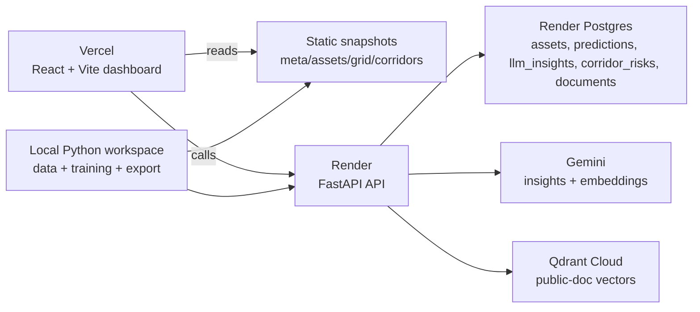

# Free-Stack Architecture

This repo now follows a hybrid free-tier architecture:

- static snapshots for resilient dashboard startup
- live FastAPI inference for model-backed actions
- Render Postgres for structured cache and app records
- Qdrant for optional public-document retrieval

## System diagram



## Why this architecture

### Snapshot-first boot

The dashboard should never depend on the backend waking up before the user sees anything useful.

So the UI boots from:

- `frontend/public/snapshots/meta.json`
- `frontend/public/snapshots/assets.json`
- `frontend/public/snapshots/grid.json`
- `frontend/public/snapshots/corridors.json`

These files are also mirrored to `data/processed/snapshots/` for local inspection and downstream reuse.

### Live API only where it matters

The Render service is reserved for things that are actually worth a backend:

- model inference
- cache persistence
- Gemini summaries
- RAG chat over indexed public PDFs

That keeps the free-tier setup practical while still making the project look and behave like a real product.

## Frontend design choices

- React + Vite for simple Vercel deployment and fast local iteration
- Tailwind for consistent control-room styling
- Tremor for dashboard primitives
- Recharts for custom time-series and heatmap views
- React-Leaflet + OpenStreetMap for corridor mapping with no paid map API
- TanStack Query for static snapshot and API caching

## Backend design choices

- FastAPI for lightweight typed REST endpoints
- SQLAlchemy for portable Postgres/SQLite access
- local model loading from `backend/models/` or root `models/`
- optional Hugging Face fallback for artifact download in deployment
- graceful AI fallback behavior when Gemini or Qdrant credentials are missing

## Database model

### Render Postgres tables

- `assets`: normalized asset registry for app lookups and seeding
- `predictions`: cached model outputs by prediction type and payload hash
- `llm_insights`: Gemini response cache with TTL
- `corridor_risks`: current NDVI-derived risk registry
- `documents`: public-document chunk metadata mirrored from ingestion

## RAG model

### Inputs

- POWERGRID annual reports
- Grid India / POSOCO public reports
- public technical guidelines

### Flow

1. PDFs are placed into `data/ingestion/`
2. `backend/ingestion/ingest_documents.py` extracts text
3. text is chunked and embedded with Gemini
4. vectors are upserted into Qdrant
5. chunk metadata is saved into Postgres
6. `/api/chat/rag` queries Qdrant and returns citation-aware answers

## API contract summary

- `GET /health`
- `POST /api/predict/rul`
- `POST /api/predict/anomaly`
- `GET /api/forecast/load`
- `POST /api/predict/outage-cause`
- `POST /api/predict/ndvi-risk`
- `POST /api/llm/insight`
- `POST /api/chat/rag`

## Free-tier tradeoffs

### Render free web service

- cold starts are acceptable because the frontend is snapshot-driven

### Render free Postgres

- short-lived but acceptable for internship/demo windows

### Gemini free tier

- keep calls button-triggered only
- cache aggressively

### Qdrant free tier

- keep the v1 corpus small and curated

## Recommended release loop

```bash
py utils/export_dashboard_snapshot.py
cd frontend
npm run lint
npm run build
cd ..\\backend
uvicorn app.main:app --reload --port 8000
```

## v1 boundaries

Version 1 deliberately excludes:

- auth
- user-specific data
- paid hosting
- live training jobs in production
- auto-triggered LLM calls on page load

Those can be added later without changing the basic monorepo structure.
